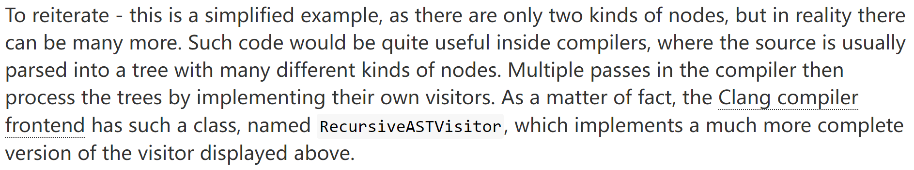

# CRTP intro
## What is CRTP?
> The CRTP consists in:
**inheriting from a template class**,
use the derived class itself as a **template parameter of the base class**.

`sample code` 
```cpp
template <typename T>
class Base
{
    ...
};

class Derived : public Base<Derived>
{
    ...
};
```

## Error case
### Case1
> Undefined behavior when two classes derived from the same class!

```cpp
class Derived1 : public Base<Derived1>
{
    ...
};

class Derived2 : public Base<Derived1> // bug in this line of code
{
    ...
};
```
what we can do to solve it?
> Marek Kurdej:   
> 1. adding a private constructor in the base class
> 2. making the base class friend with the templated class

The whole method is so called private-constructor and template-friend trick.

## Influence on real codes
>Let's see how CRTP bring benefit to real codes.  
### Extending Function
```cpp
#include <iostream>

// 接口，包括数值计算库
template<typename T>
class NumericalFunctions 
{
public:
    void scale(double multiplicator) {
        T& underlying = static_cast<T&>(*this);
        double result = underlying.getValue() * multiplicator;
        std::cout << "result: " << result << std::endl;
    }
};

class Sensitivity : public NumericalFunctions<Sensitivity> {
public:
    Sensitivity(double value) : _value(value) {}
    double getValue() { return _value; }

private:
    double _value; 
};

int main() {
    Sensitivity a = Sensitivity(0.4);
    a.scale(0.2);

    return 0;
}
```

<font color = green>Why CRTP, not template function?</font>
> More **compatible interface**!!! More easy to read.

<font color = green>The essence of CRTP</font>
> Therefore the base class is not the interface, and the derived class is not the implementation. Rather, it is the other way around: the base class uses the derived class methods (such as getValue and setValue). In this regard, **the derived class offers an interface to the base class**. This illustrates again the fact that inheritance in the context of the CRTP can express quite a different thing from classical inheritance.

### Static Interfaces
What we are interested in is Dynamic polymorphism vs. Static polymorephism. 
> Dyanmic one:  
Extra indirection (pointer dereference) for each call to a virtual method.  
**Virtual methods usually can't be inlined**, which may be a significant cost hit for some small methods.  
Additional pointer per object. On 64-bit systems which are prevalent these days, this is 8 bytes per object. For small objects that carry little data this may be **a serious overhead**.


## Performance
> The source ariticle is `The cost of dynamic (virtual calls) vs. static (CRTP) dispatch in C++` by Eli Benderski.  


## Application
  
Following is a kind of tree traversal visitor. In clang, there are many codes like that:  
`Generic visitor pattern`
```cpp
struct TreeNode
{
    enum Kind {RED, BLUE};

    TreeNode(Kind kind_, TreeNode* left_ = NULL, TreeNode* right_ = NULL)
        : kind(kind_), left(left_), right(right_)
    {}

    Kind kind;
    TreeNode *left, *right;
};

template <typename Derived>
class GenericVisitor
{
public:
    void visit_preorder(TreeNode* node)
    {
        if (node) {
            dispatch_node(node);
            visit_preorder(node->left);
            visit_preorder(node->right);
        }
    }

    void visit_inorder(TreeNode* node)
    {
        if (node) {
            visit_inorder(node->left);
            dispatch_node(node);
            visit_inorder(node->right);
        }
    }

    void visit_postorder(TreeNode* node)
    {
        if (node) {
            visit_postorder(node->left);
            visit_postorder(node->right);
            dispatch_node(node);
        }
    }

    void handle_RED(TreeNode* node)
    {
        cerr << "Generic handle RED\n";
    }

    void handle_BLUE(TreeNode* node)
    {
        cerr << "Generic handle BLUE\n";
    }

private:
    // Convenience method for CRTP
    //
    Derived& derived()
    {
        return *static_cast<Derived*>(this);
    }

    void dispatch_node(TreeNode* node)
    {
        switch (node->kind) {
            case TreeNode::RED:
                derived().handle_RED(node);
                break;
            case TreeNode::BLUE:
                derived().handle_BLUE(node);
                break;
            default:
                assert(0);
        }
    }
};
```
`Specialized visitor pattern`
```cpp
class SpecialVisitor : public GenericVisitor<SpecialVisitor>
{
public:
    void handle_RED(TreeNode* node)
    {
        cerr << "RED is special\n";
    }
};
```

### Helper for CRTP
```cpp
template <typename T>
struct crtp
{
    T& underlying() { return static_cast<T&>(*this); }
    T const& underlying() const { return static_cast<T const&>(*this); }
};
```

```cpp
template <typename T>
struct NumericalFunctions : crtp<T>
{
    void scale(double multiplicator)
    {
        this->underlying().setValue(this->underlying().getValue() * multiplicator);
    }
    ...
};
```


## References
* https://www.fluentcpp.com/2017/05/12/curiously-recurring-template-pattern/
* https://eli.thegreenplace.net/2011/05/17/the-curiously-recurring-template-pattern-in-c/
* https://eli.thegreenplace.net/2013/12/05/the-cost-of-dynamic-virtual-calls-vs-static-crtp-dispatch-in-c


